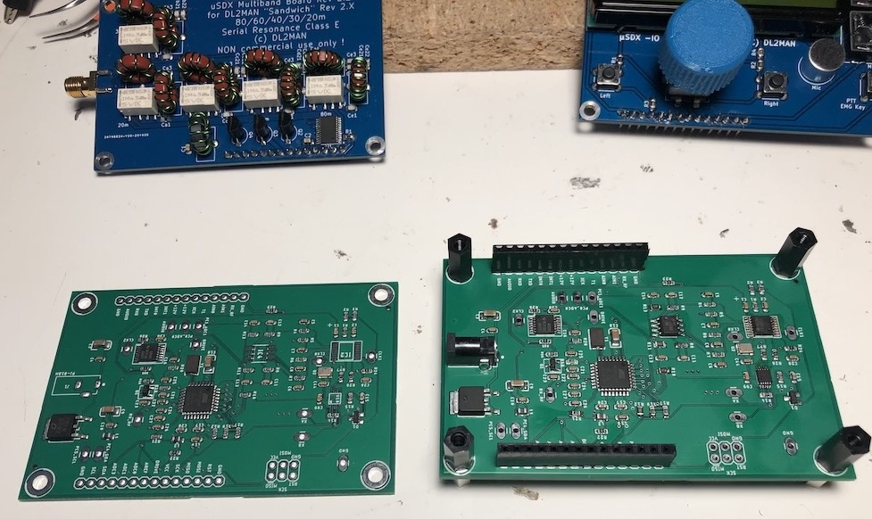

# TQFP Sandwich

## A drop-in replacement for the [DL2MAN Sandwich Mainboard v2.4](https://dl2man.de/mainboard/)

Benefits:

- ATM328P on TQFP-32 footprint + all SMD components + single side, 2 layers design ($2 per 5 bare PCBs at JLCPCB)
- Available CPL and BOM files for rapid prototyping orders (~$39 for 5 fully assembled PCBs at JLCPCB)
- Round barrel jack connector compatible with the FT-817 (1.70mm ID - 4.00mm OD)
- Temperature Controlled Oscillator (TCXO) for absolute frequency precision (alignment no longer necessary)
- Extra 0 ohm resistors / contact pads for easier experimenting and troubleshooting

Parts not available (or currently not in stock) at LCSC that need to be sourced and installed autonomously:

- FST3253MTCX
- ASTX-H11-27.000MHZ-T
- LM4562MAX
- PJ-18H

Known Issues:

So far I have been unable to source a Chinese TCXO that can reliably replace the ASTX-H11. If you have more luck, please let me know
