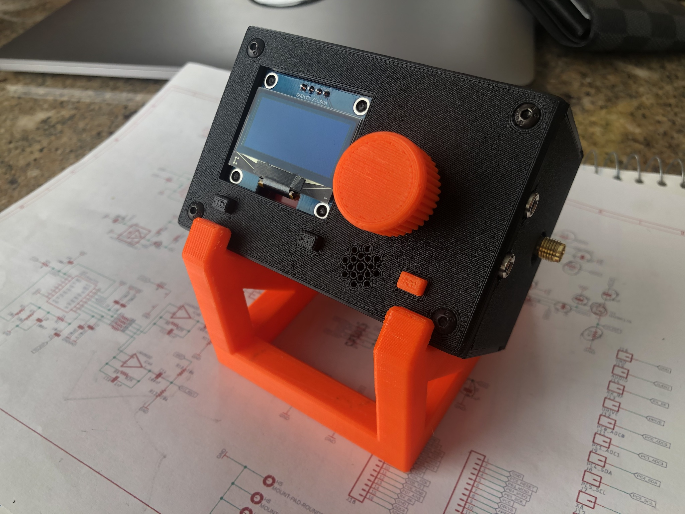

# TQFP Sandwich

## A fully open sourced drop-in replacement for the [DL2MAN Sandwich](https://dl2man.de/)

This sligthly modified version of [Manuel DL2MAN](https://dl2man.de/)'s exceptional project was originally motivated by the need of a proper power connector and a TCXO. Subsequently an SWR meter and a 1.3" oled display were added.

### Boards

#### Main

- ATM328P on TQFP-32 footprint + all SMD components + single side, 2 layers design ($2 per 5 bare PCBs at JLCPCB)
- Available CPL and BOM files for rapid prototyping orders (~$39 for 5 fully assembled PCBs at JLCPCB ***)
- Round barrel jack connector compatible with the FT-817 (1.70mm ID - 4.00mm OD)
- Temperature Controlled Oscillator (TCXO) for absolute frequency precision (alignment no longer necessary)
- Extra 0 ohm resistors / contact pads for easier experimenting and troubleshooting

#### UI

- Accepts both 0.96" and 1.3" OLED displays
- Anti-bounce capacitors allowing for low-cost encoders being used
- Optional GPS receiver + antenna (not yet tested)
- Optional LM386 audio amplifier (not yet tested)

#### RF

- Compatible with DL2MAN REV3 standard RF boards
- Onboard SWR/Wattmeter
- High bands design: 10m, 15m, 20m, 30m, 40m
- SMD design allows for using either a single IRLML2060 or three MMBF170's (caps and toroids need to be matched accordingly)
- SMD Relays (Omron G6KU-2G-Y)

*** Parts not available (or currently not in stock) at LCSC that need to be sourced and installed separately: PJ-18H, Si5351, LM4562MAX, ASTX-H11-27.000MHZ-T, FST3253MTCX

### Testing

 This project is to be considered as experimental. If you are looking for stability and reliabiality, I'd recommend sticking to the original. 

| Board | Number built | Remarks                                                      | Issues                                                       |
| :---: | :----------: | ------------------------------------------------------------ | ------------------------------------------------------------ |
| Main  |      4       | - No performance differences from the original found yet. - Only tested with OLED displays. |                                                              |
|  UI   |      5       | - Most 1.3" displays work normally but some require [a software patch](https://groups.io/g/ucx/message/5147?p=,,,20,0,0,0::Created,,reverted,20,2,0,79343439) (this would be the case for all UI boards, not just this particular one). | GPS and audio amplifier (both optional) not yet tested.      |
|  RF   |      1       | - Uses the REV3 IO Extender configuration with 3x SOT23 mosfets therefore passive components can be dimensioned after BS170/MMBF170's or IRLML2060's. - [The SWR meter software](https://github.com/adecarolis/QCX-SSB/tree/swr-meter) modification currently only works for CW when using the straight key. | So far only tested on 20 meters and 40 meters using 3x BS170 mosfets: good performance on 20 meters, not good on 40. |

### License

Creative Commons 3.0

https://creativecommons.org/licenses/by-sa/3.0/

### Disclaimer

COVERED SOFTWARE IS PROVIDED UNDER THIS LICENSE ON AN "AS IS" BASIS, WITHOUT WARRANTY OF ANY KIND, EITHER EXPRESSED OR IMPLIED, INCLUDING, WITHOUT LIMITATION, WARRANTIES THAT THE COVERED SOFTWARE IS FREE OF DEFECTS, MERCHANTABLE, FIT FOR A PARTICULAR PURPOSE OR NON-INFRINGING. THE ENTIRE RISK AS TO THE QUALITY AND PERFORMANCE OF THE COVERED SOFTWARE IS WITH YOU. SHOULD ANY COVERED SOFTWARE PROVE DEFECTIVE IN ANY RESPECT, YOU (NOT THE INITIAL DEVELOPER OR ANY OTHER CONTRIBUTOR) ASSUME THE COST OF ANY NECESSARY SERVICING, REPAIR OR CORRECTION. THIS DISCLAIMER OF WARRANTY CONSTITUTES AN ESSENTIAL PART OF THIS LICENSE. NO USE OF ANY COVERED SOFTWARE IS AUTHORIZED HEREUNDER EXCEPT UNDER THIS DISCLAIMER.
